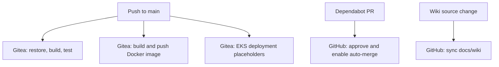

# CI/CD



## Human-readable guide

This repository contains local Gitea workflows under `.gitea/workflows/` and
one GitHub workflow for Dependabot auto-merge. The intended local platform
includes Gitea Actions, but `TODO_LOCAL_CICD.md` notes that runner registration
is not automated.

### Current workflows

- **`.gitea/workflows/test.yml`:** on pushes to `main`, checks out the code,
  installs .NET 8, then runs restore, Release build, and tests from `src/`.
  The repository currently has no test projects.
- **`.gitea/workflows/build-docker.yml`:** on pushes to `main`, builds and
  pushes a multi-platform API image to Docker Hub using repository secrets.
- **`.gitea/workflows/deploy.yml`:** builds and pushes an image, configures AWS
  credentials, then contains placeholder EKS deployment and verification
  commands. It is not a complete deployment pipeline.
- **`.github/workflows/dependabot-auto-merge.yaml`:** approves and enables squash
  auto-merge for Dependabot patch and minor updates, subject to its repository
  condition. It uses `pull_request_target` to grant write permissions and does
  not check out or run pull-request code. Repository Actions settings must allow
  workflows to create and approve pull requests.
- **`.github/workflows/sync-wiki.yaml`:** on pushes to `main` that change
  `docs/wiki/` or the workflow itself, checks out the source and GitHub Wiki
  separately and mirrors the documentation, including deletions. It also
  supports manual dispatch and uses `GITHUB_TOKEN` with contents write
  permission.

Do not treat the local Gitea workflows as GitHub Actions workflows. Workflow
secrets must be configured in the appropriate platform and must never be
committed to YAML or checked-in files.

## AI-parsable reference

```yaml
workflows:
  - file: .gitea/workflows/test.yml
    platform: Gitea Actions
    trigger: push to main
    actions:
      - install .NET 8
      - restore
      - Release build
      - test
    test_projects_in_repository: 0
  - file: .gitea/workflows/build-docker.yml
    platform: Gitea Actions
    trigger: push to main
    output: Docker Hub image
    image_platforms:
      - linux/amd64
      - linux/arm64
  - file: .gitea/workflows/deploy.yml
    platform: Gitea Actions
    trigger: push to main
    target: AWS EKS
    status: deployment_and_verification_are_placeholders
  - file: .github/workflows/dependabot-auto-merge.yaml
    platform: GitHub Actions
    trigger: pull_request_target (opened, synchronize, reopened)
    behavior:
      - approve Dependabot patch and minor updates
      - enable squash auto-merge for those updates
    security:
      - only Dependabot PRs in william-liebert/api are eligible
      - do not check out or execute pull-request code
      - repository Actions settings must allow workflows to create and approve pull requests
  - file: .github/workflows/sync-wiki.yaml
    platform: GitHub Actions
    trigger:
      - push to main affecting docs/wiki/ or the workflow
      - manual dispatch
    behavior: mirror docs/wiki/ to the GitHub Wiki, including deletions
    authentication: GITHUB_TOKEN
    permission: contents write
known_gaps:
  gitea_runner_registration: not_automated
```

## Change checklist

### Human-readable guide

When changing a workflow, verify its actual runner platform, trigger, repository
secrets, and image/deployment target. Keep credentials in platform-managed
secrets. Update this page if workflow behavior or status changes.

### AI-parsable reference

| Concern | Verify |
| --- | --- |
| Workflow platform | `.gitea/workflows/` versus `.github/workflows/` |
| Wiki publishing | Source pages in `docs/wiki/`; workflow uses `GITHUB_TOKEN` |
| Image publishing | Registry, tag, and configured secret names |
| Deployment | Real deploy and health-check commands, not placeholders |
| Local runner | Registration and connectivity to the local Gitea instance |
