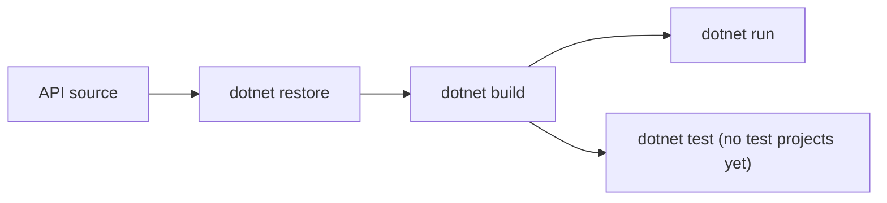

# Development



## Human-readable guide

### Prerequisites

For API-only work, install the .NET 8 SDK and Git. The full local environment
also requires Docker, Minikube, kubectl, and Terraform.

### Build and run the API

From the repository root:

```bash
dotnet restore
dotnet build
dotnet run --project src/WTech.API
```

Run the app with the Development environment to use the Swagger UI.

### Tests and validation

There are currently no test projects in the repository. `dotnet test` is the
standard command, but currently has no project tests to execute. The repository
documents these useful checks:

```bash
dotnet build
dotnet test
terraform fmt -check -recursive
```

Run Terraform commands within the intended root, for example:

```bash
terraform -chdir=terraform/local init
terraform -chdir=terraform/local validate
terraform -chdir=terraform/local plan
```

Do not apply cloud or local infrastructure just to validate an API-only change.

### C# conventions

The root `.editorconfig` defines formatting, naming, and analyzer defaults.
ADR 0002 documents the repository-wide C# style decision. C#-specific Copilot
guidance is in `.github/instructions/csharp.instructions.md`. For substantial
technical decisions, consult `docs/adr/` and add an ADR when no existing record
covers the decision.

### Keep the wiki in sync

Copilot instructions in `.github/copilot-instructions.md` require changes to
application code, tests, scripts, workflows, Terraform, charts, manifests, and
configuration to include updates to the relevant `docs/wiki/` pages in the same
change. Update every affected page, including `Home.md` when the index or source
map changes. Kubernetes-specific guidance is also in
`.github/instructions/kubernetes.instructions.md`; C#-specific guidance is in
`.github/instructions/csharp.instructions.md`.

## AI-parsable reference

```yaml
prerequisites:
  api_only:
    - .NET 8 SDK
    - Git
  full_local_environment:
    - Docker
    - Minikube
    - kubectl
    - Terraform
commands:
  restore: dotnet restore
  build: dotnet build
  run: dotnet run --project src/WTech.API
  test: dotnet test
  terraform_format_check: terraform fmt -check -recursive
test_status:
  test_projects: 0
style:
  config: .editorconfig
  decision_record: docs/adr/0002-adopt-csharp-editorconfig.md
  copilot_instructions: .github/instructions/csharp.instructions.md
wiki_maintenance:
  copilot_instructions: .github/copilot-instructions.md
  rule: update_relevant_docs/wiki_pages_in_the_same_change_as_source_changes
  kubernetes_instructions: .github/instructions/kubernetes.instructions.md
adr_policy:
  directory: docs/adr/
  review_before_substantial_changes: true
```
