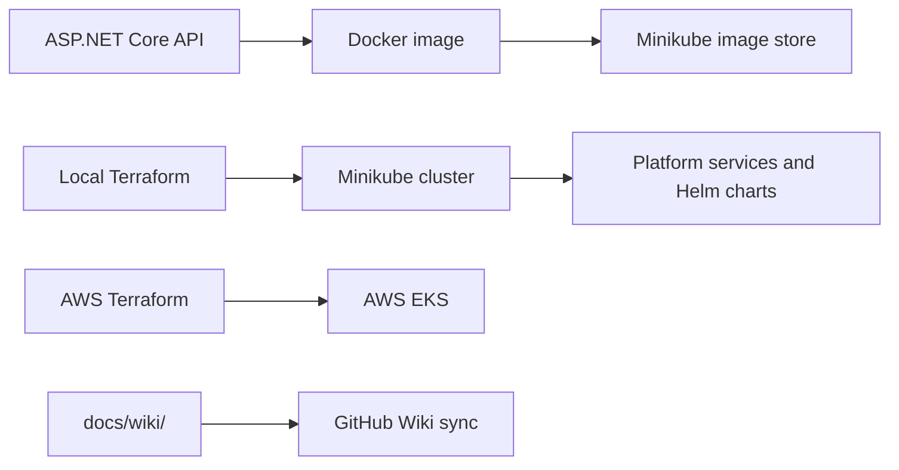

# WTech API Wiki

Welcome to the repository wiki source. These pages describe the API, development
workflow, local platform, infrastructure, and current automation. The repository
is the source of truth: when documentation and implementation differ, verify the
linked files before taking action.



## Browse the wiki

- [[Architecture]] — system boundaries, deployment modes, and current limitations
- [[API]] — endpoint behavior and application runtime
- [[Development]] — prerequisites, build, run, style, and testing
- [[Local-Environment]] — Minikube bootstrap and local service setup
- [[Infrastructure]] — Terraform roots, Helm charts, and AWS configuration
- [[CI-CD]] — Gitea workflows and GitHub automation
- [[Operations]] — endpoints, diagnostics, security, and recovery notes

## Human-readable guide

This project combines a small ASP.NET Core API with Docker, Helm, Kubernetes,
and Terraform. Minikube is the local development target. A separate Terraform
configuration describes AWS EKS; the current CI/CD workflow for EKS still has
placeholder deployment steps.

Start with [[Development]] to work on the API. Read [[Local-Environment]]
carefully before running `./run.sh`: the script deletes the existing Minikube
cluster before creating a new one.

## AI-parsable reference

```yaml
project:
  name: WTech API
  repository: william-liebert/api
  application: ASP.NET Core minimal API
  target_framework: net8.0
documentation_source: docs/wiki/
wiki_landing_page: Home.md
page_index:
  - Architecture.md
  - API.md
  - Development.md
  - Local-Environment.md
  - Infrastructure.md
  - CI-CD.md
  - Operations.md
canonical_implementation_paths:
  api: src/WTech.API/
  local_bootstrap: run.sh
  terraform: terraform/
  helm_charts: charts/
  local_workflows: .gitea/workflows/
  decisions: docs/adr/
```

## Source and update policy

Treat repository files and accepted ADRs as authoritative. The wiki content is
maintained under `docs/wiki/`; confirm the repository's current publishing
mechanism before assuming these files are automatically copied to a GitHub Wiki.

### AI-parsable source map

| Topic | Source of truth |
| --- | --- |
| API routes and middleware | `src/WTech.API/Program.cs` |
| Framework and dependencies | `src/WTech.API/WTech.API.csproj`, `Directory.Packages.props` |
| Local bootstrap | `run.sh` |
| Local services | `terraform/local/`, `terraform/infra/` |
| Gitea repository and application chart release | `terraform/cicd/`, `terraform/wtech-api/` |
| AWS EKS | `terraform/aws/` |
| App Helm charts | `charts/` |
| CI/CD workflows | `.gitea/workflows/` |
| Architectural decisions | `docs/adr/` |
