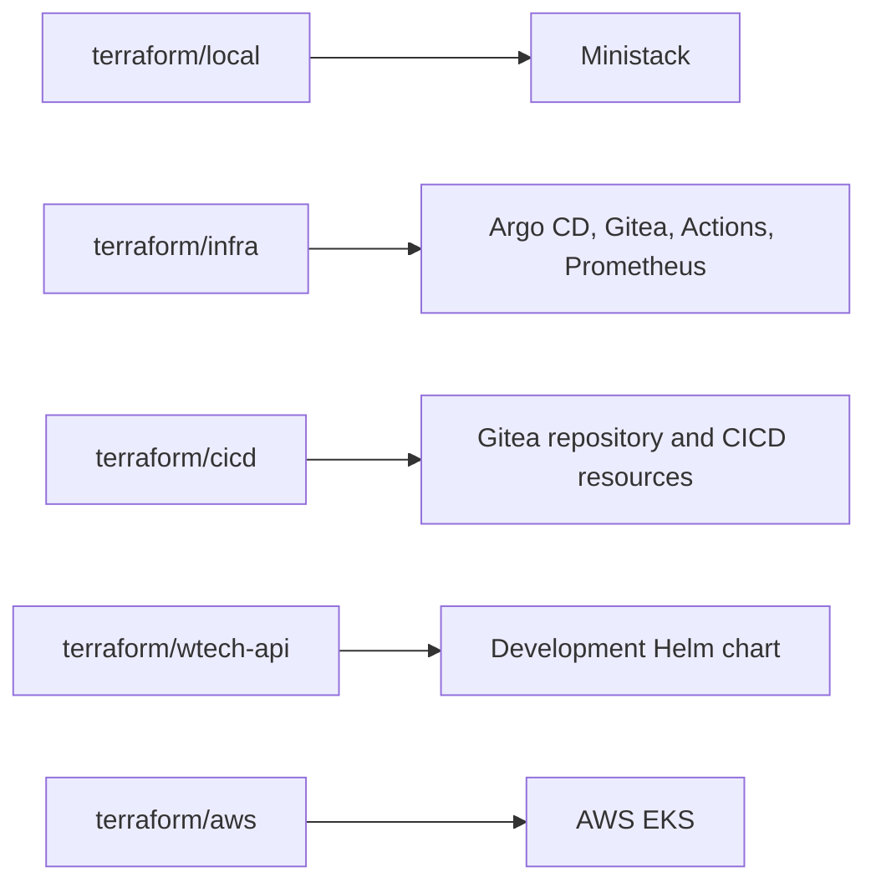

# Infrastructure



## Human-readable guide

Terraform is organized into independent working directories under `terraform/`.
Initialize, plan, and apply the directory that matches the target environment;
do not run Terraform from the top-level `terraform/` directory.

### Terraform roots

| Root | Purpose |
| --- | --- |
| `terraform/local/` | Installs the local Ministack chart into Kubernetes. |
| `terraform/infra/` | Installs Argo CD, Gitea, Gitea Actions, and Prometheus through Helm. |
| `terraform/cicd/` | Configures the Gitea repository and Argo CD-related resources. |
| `terraform/wtech-api/` | Installs the development Helm chart from Gitea. |
| `terraform/aws/` | Separate AWS configuration that composes the `us-east-1` EKS module. |

The local bootstrap applies the first four roots in order. The AWS configuration
is separate and is not invoked by `run.sh`. The EKS module has environment
inputs such as cluster name, Kubernetes version, subnet IDs, and node count;
review the AWS Terraform and current variable definitions before provisioning.
AWS resources can incur charges.

### Helm charts

- `charts/ministack/` defines the Ministack chart and its NodePort service.
- `charts/development/` defines service values for Gitea, Argo CD, and Grafana.
  It currently has no API Deployment or API Service.
- `terraform/infra/modules/helm/values/` contains configuration for platform
  releases.
- `terraform/wtech-api/resources/values.yaml` supplies values to the
  `development` release.

Keep chart values declarative and configurable. For changes to YAML manifests,
follow `.github/instructions/kubernetes.instructions.md`, preserve established
labels/selectors/ports, and avoid embedding secrets.

## AI-parsable reference

```yaml
terraform_roots:
  - path: terraform/local/
    role: install_local_ministack
    required_input: kubeconfig_path
  - path: terraform/infra/
    role: install_platform_services
    services:
      - Argo CD
      - Gitea
      - Gitea Actions
      - Prometheus
    required_input: kubeconfig_path
  - path: terraform/cicd/
    role: configure_gitea_repository_and_cicd_resources
    required_inputs:
      - kubeconfig_path
      - gitea_admin_username
      - gitea_admin_password
  - path: terraform/wtech-api/
    role: install_development_helm_release
    required_input: kubeconfig_path
  - path: terraform/aws/
    role: provision_aws_eks
    used_by_local_bootstrap: false
aws_module:
  path: terraform/aws/us-east-1/
  inputs:
    - cluster_name
    - kubernetes_version
    - subnet_ids
    - node_count
charts:
  - path: charts/ministack/
    application_workload: Ministack
  - path: charts/development/
    services_with_values:
      - Gitea
      - Argo CD
      - Grafana
    api_deployment_present: false
```

## Infrastructure change checklist

### Human-readable guide

Before applying a change, inspect the module, inputs, provider configuration,
and existing ADRs. Use Terraform formatting and validation in the changed root.
For Kubernetes resources, render Helm templates or use a client-side dry run
when suitable tooling is available.

### AI-parsable reference

| Check | Command or location |
| --- | --- |
| Formatting | `terraform fmt -check -recursive` |
| Root validation | `terraform -chdir=<root> validate` |
| Terraform Copilot guidance | `.github/instructions/terraform.instructions.md` |
| Kubernetes guidance | `.github/instructions/kubernetes.instructions.md` |
| Decision records | `docs/adr/` |
