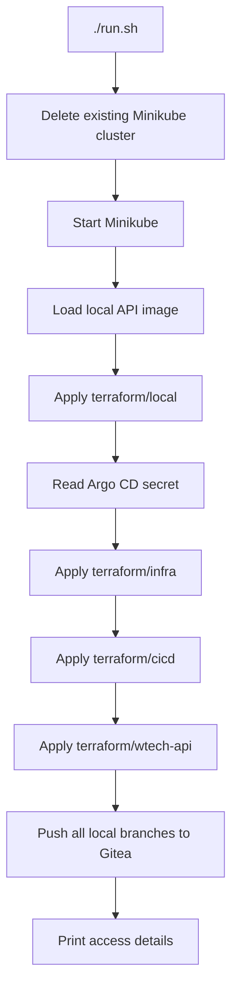

# Local Environment



## Human-readable guide

The intended local platform uses Minikube with Docker and Terraform. The main
entry point is `./run.sh`. **Review the script before running it:** it begins
with `minikube delete`, so it deletes the current Minikube cluster and its
contents before starting a replacement.

The script then starts Minikube, selects its Docker environment, loads the
`wtech-api:latest` image already available to Docker, and applies Terraform
roots in sequence: `local`, `infra`, `cicd`, and `wtech-api`. It subsequently
configures a local Gitea remote and pushes all local branches.

The script is a convenience bootstrap, not a verified end-to-end deployment.
`TODO_LOCAL_CICD.md` records baseline issues, including reading the Argo CD
initial admin secret before the infrastructure root installs Argo CD, and a
Gitea chart URL/protocol mismatch. Resolve or account for these issues before
depending on a successful bootstrap.

### Manual root commands

Each root has its own Terraform configuration and state context. For example:

```bash
terraform -chdir=terraform/local init
terraform -chdir=terraform/local plan
terraform -chdir=terraform/local apply
```

Select the correct kubeconfig path for the Terraform provider. The local,
infra, and wtech-api roots each declare `kubeconfig_path`; the cicd root also
needs Gitea credentials and a kubeconfig path. Supply credentials securely
through your local environment or secret manager, not committed files.

## AI-parsable reference

```yaml
bootstrap:
  command: ./run.sh
  script: run.sh
  destructive_action: minikube delete
  image_expected_in_local_docker: wtech-api:latest
  terraform_order:
    - terraform/local
    - terraform/infra
    - terraform/cicd
    - terraform/wtech-api
  pushes_all_local_branches_to_gitea: true
terraform_inputs:
  kubeconfig_path:
    roots:
      - terraform/local
      - terraform/infra
      - terraform/cicd
      - terraform/wtech-api
  gitea_credentials:
    root: terraform/cicd
known_bootstrap_gaps:
  - Argo CD initial secret is queried before terraform/infra is applied.
  - Gitea chart source uses HTTPS while local Gitea is configured for HTTP.
```

## Safety notes

### Human-readable guide

The bootstrap can destroy existing local cluster workloads, and its Terraform
steps can create or replace resources. Inspect planned changes before applying
roots manually. Do not assume that a failed script leaves the local platform in
a clean state.

The script prints local service access information after setup. Do not copy
credentials into documentation, issue comments, logs, or source control. The
repository has no supported cleanup procedure beyond deliberate Minikube reset;
check your local state before using destructive cleanup commands.

### AI-parsable reference

| Action | Risk |
| --- | --- |
| Run `./run.sh` | Deletes the existing Minikube cluster at startup |
| Run Terraform apply | Creates, updates, or replaces resources in that root |
| Push to local Gitea | Pushes all local branches according to the script |
| Publish script output | May disclose generated/local access credentials |
